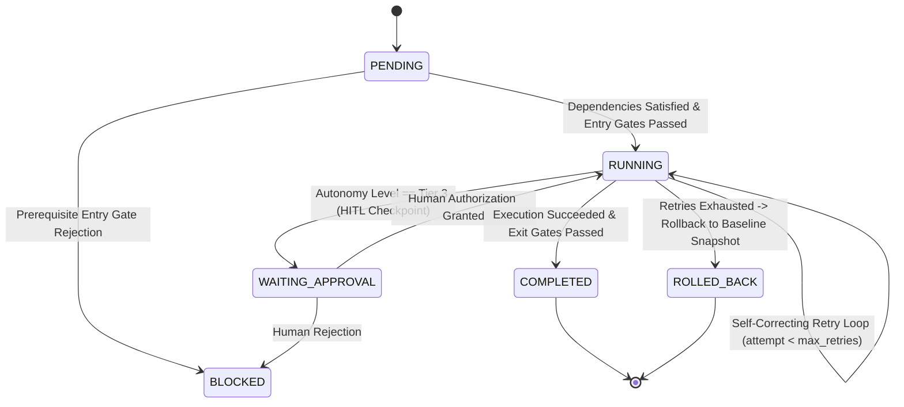

# Architecture Treatise: Apex-SDLC Engine & PulseURL System

## 1. Architectural Philosophy: Governed Autonomous Engineering

Most simplistic AI coding systems rely on **linear prompting pipelines** (`Prompt -> Code -> Output`). In enterprise software engineering environments (such as financial services), this unstructured approach fails due to:
1. **Unbounded Hallucination & Scope Creep**: Inability to detect underspecified or conflicting requirements.
2. **Lack of Invariant Gating**: Deploying code that compiles but violates security, latency, or compliance policies.
3. **Irreversible Mutations**: Corrupting working codebases upon encountering downstream failures.
4. **Zero Auditability**: Complete absence of cryptographic decision provenance for regulatory review.

**Apex-SDLC** addresses these challenges by introducing **Governed Controlled Autonomy**, operating on the core engineering principle:
> **Agents execute multi-step work under strict policy boundaries; humans own oversight, high-impact approvals, and final quality control.**

---

## 2. High-Level System Architecture

```mermaid
flowchart TD
    subgraph UI ["Observation & Interaction Layer"]
        CLI["Rich Terminal CLI (Runner & Approval Prompt)"]
        Dashboard["FastAPI Real-Time Web Console"]
    end

    subgraph Orchestrator ["Agentic SDLC Orchestration Engine"]
        Engine["DAG Workflow Engine & Scheduler"]
        StateStore["SDLC State & Shared Context Store"]
        Gatekeeper["Entry & Exit Policy Gatekeeper"]
        SafetyCtrl["Snapshot, Rollback & Bounded Retry Controller"]
        Lineage["Cryptographic Decision Lineage Tracker"]
        Metrics["Reliability & Telemetry Collector (MTTR, Latency)"]
    end

    subgraph Agents ["Specialized SDLC Agents"]
        A_Req["Requirement & Ambiguity Analyzer"]
        A_Arch["Software Architect & Threat Modeler"]
        A_Reason["Codebase Reasoner (Static AST & Impact Graph)"]
        A_Impl["Code Implementation Agent"]
        A_Test["Quality & Test Engineer"]
        A_Sec["Security & Compliance Guardrail Agent"]
        A_Doc["Documentation & Release Readiness Agent"]
    end

    subgraph Artifact ["Target System: PulseURL Service"]
        FastAPI_App["FastAPI Routers (/api/v1/urls, /{short_code})"]
        Base62_Engine["Base62 Hash Seeder & Collision Resolver"]
        RateLimiter["Sliding-Window Token Bucket Rate Limiter"]
        SecurityValidator["SSRF Guardrail & IP Anonymizer"]
        AnalyticsService["Multi-Device Telemetry & Aggregation"]
        Database[(SQLAlchemy ORM & SQLite Storage)]
    end

    UI --> Orchestrator
    Orchestrator --> Agents
    Agents --> Artifact
```

---

## 3. The Non-Linear DAG Execution Model

### 3.1 Task Node State Machine
Each lifecycle stage in the SDLC is encapsulated as a `TaskNode` with state transitions governed by the orchestrator:

### 3.2 Parallel Execution Groups & Synchronization Barriers
Unlike linear orchestrators, Apex-SDLC supports parallel task execution with strict synchronization barriers:
- In **Scenario 1 (Greenfield)**, `Unit & Integration Testing` and `Security & SSRF Compliance Audit` execute simultaneously in a shared parallel group (`verification_sync_group`).
- The downstream `Documentation & Runbook` stage acts as a **synchronization barrier**, refusing to schedule until *both* parallel streams satisfy their exit gates.

### 3.3 Dynamic Re-Planning Engine
When upstream outputs invalidate downstream assumptions, the DAG is dynamically restructured at runtime:
1. `DAGEngine.dynamic_replan(new_nodes, invalidated_nodes)`
2. Target nodes are injected or updated in the active dependency map.
3. Downstream nodes have their status reset to `PENDING` with cleared error counters.
4. Decision Lineage logs the dynamic replan rationale with input/output diff hashes.

---

## 4. Controlled Autonomy & Governance Framework

### 4.1 Four-Tier Autonomy Classification

| Autonomy Tier | Scope & Activities | Governance Controls |
| :--- | :--- | :--- |
| **Tier 0: Read-Only Analysis** | Requirement parsing, intent extraction, AST codebase scanning, architectural design. | Fully autonomous execution. Lineage captured. |
| **Tier 1: Low-Risk Generation** | Unit test synthesis, OpenAPI documentation, developer runbooks, changelogs. | Autonomous execution gated by automated syntax and type checkers. |
| **Tier 2: Code Implementation** | Feature code generation, refactoring, bug fixes, algorithm optimizations. | Monitored autonomy. Mandatory pre-mutation snapshot, 100% test pass gate, 0 critical security issues. |
| **Tier 3: High-Impact Operations** | Database schema migrations, production deployments, container release tagging. | **Strict Human-in-the-Loop (HITL) Checkpoint**. Execution pauses until an authorized human engineer reviews diff and signs off. |

### 4.2 Entry and Exit Gate Specifications

#### Entry Gates
- `ambiguity_threshold`: Evaluates requirement ambiguity score. If score > 0.30, halts execution and prompts for human clarification.
- `dependencies_completed`: Verifies that all upstream nodes in the DAG have status `COMPLETED`.
- `workspace_snapshot_ready`: Ensures a valid transactional snapshot is committed prior to mutating any code or schema.
- `contract_defined`: Prohibits code generation unless an approved API/architecture contract exists in shared context.

#### Exit Gates
- `test_coverage_and_pass`: Requires 100% pass rate across functional, edge-case, and regression suites.
- `security_compliance`: Rejects output if critical or high vulnerabilities are detected, secrets are leaked, or SSRF protection is disabled.
- `syntax_and_types`: Validates Python AST parsing and type conformance.
- `human_signoff`: Evaluates explicit human authorization for Tier 3 tasks.
- `release_readiness`: Requires aggregate readiness score &ge; 90.0%.

---

## 5. Resilience & Fault-Tolerance Architecture

### 5.1 Bounded Retries with Exponential Backoff
When a stage fails (e.g. test failure or gate rejection):
$$\text{Backoff}(attempt) = \text{base\_backoff} \times 2^{(attempt - 1)}$$
The error message and compiler/test diagnostics are injected back into the node's `input_payload`, allowing the agent to self-heal.

### 5.2 Transactional Workspace Snapshotting & Rollback
Prior to any Tier 2 or Tier 3 mutating task, `WorkspaceSnapshotManager` captures a clean filesystem snapshot in `.sdlc_snapshots/<snap_id>`.
If bounded retries are exhausted without achieving gate clearance:
1. Orchestrator triggers `SafeStopException`.
2. Workspace is instantly restored to the snapshot baseline, purging corrupted files and partial edits.
3. Node status is recorded as `ROLLED_BACK`.
4. Telemetry records rollback event and triggers incident notification.

---

## 6. Cryptographic Decision Lineage & Auditability

To satisfy financial-grade compliance (Schwab Internal governance):
- Every decision captures:
  - `decision_id`: Unique identifier
  - `stage` & `task_id`: Lifecycle mapping
  - `decision`: Engineering determination
  - `rationale`: Defensible reasoning
  - `alternatives_rejected`: Competing designs evaluated and reasons for rejection
  - `inputs_hash` & `outputs_hash`: Deterministic SHA-256 digests of all inputs and generated artifacts
- Merkle-like Chained Audit Log: Each log entry includes `chain_verification_hash` combining the previous hash with current artifacts:
  $$\text{ChainHash}_i = \text{SHA256}(\text{ChainHash}_{i-1} \parallel \text{DecisionID}_i \parallel \text{InputsHash}_i \parallel \text{OutputsHash}_i)$$

---

## 7. Target System: PulseURL Service Architecture

The target application built and evolved by the orchestrator conforms to industry-standard layered software design:

1. **Presentation Layer (`url_shortener/routes.py`)**:
   - FastAPI endpoints with Pydantic request/response validation.
   - HTTP 307 Temporary Redirects preserving query parameters.
2. **Security & Rate Limiting Middleware (`url_shortener/ratelimit.py`, `security.py`)**:
   - Sliding-window token bucket tracking request timestamps per client IP.
   - SSRF detector resolving hostnames and blocking direct access or DNS rebinding to private subnets (127.0.0.1, 10.0.0.0/8, 172.16.0.0/12, 192.168.0.0/16).
   - Salted SHA-256 hashing for client IP anonymization (GDPR/compliance safe).
3. **Domain Layer (`url_shortener/shortener.py`)**:
   - Base62 encoding engine mapping 64-bit integer hashes into compact 6-character tokens ($62^6 \approx 56.8 \times 10^9$ unique codes).
   - Collision resolution with salted probing and linear fallback.
   - Automatic TTL calculation and lazy/active expiration Reaper.
4. **Analytics Layer (`url_shortener/analytics.py`)**:
   - Request telemetry extraction: device categorization (Mobile, Desktop, Tablet, Bot), referrer normalization, and country geo-tagging.
   - Multi-dimensional aggregation queries grouping clicks across devices, referrers, and time-series.
5. **Persistence Layer (`url_shortener/database.py`)**:
   - SQLAlchemy 2.0 ORM with SQLite backend (PostgreSQL-compatible) indexed on `short_code` and `timestamp`.
